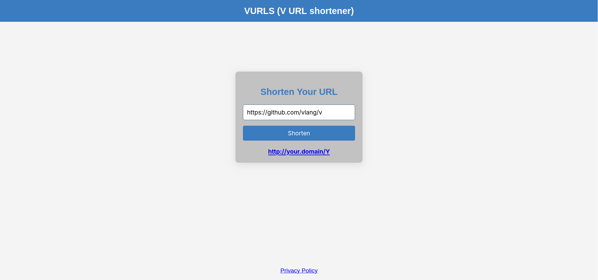
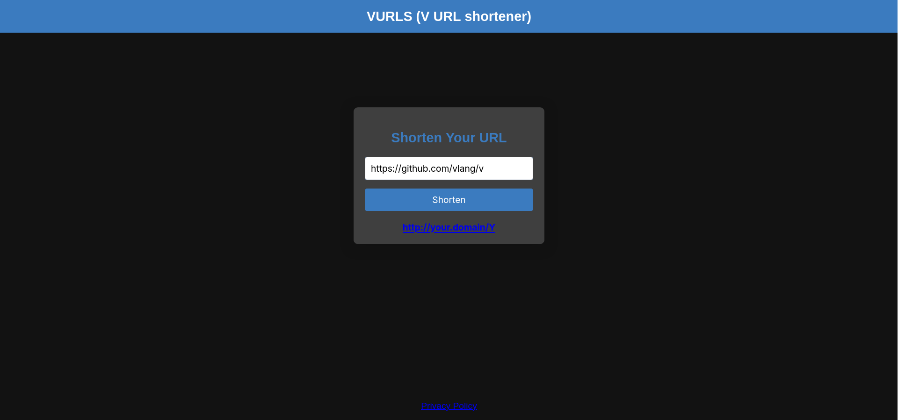

# VURLS (V URL shortener)
A web URL-shortener, written in V

Light                    | Dark
:-----------------------:|:--------------------:
 | 

## Setup

### - From release:
- Download the executable for your platform and run:
```bash
./vurls(.exe) [options]
```

### - From source:
*Requirements:*

**- [V](https://github.com/vlang/v?tab=readme-ov-file#installing-v-from-source) ~0.4.10**

**- SQLite:**

Linux:
```bash
sudo apt install libsqlite3-dev # Ubuntu/Debian
sudo pacman -S sqlite # Arch
```

Windows:

- Download `sqlite-amalgamation-XXX.zip` from [SQLite Download Page](https://www.sqlite.org/download.html)
- Navigate to V's source directory
- Create a `sqlite` directory in `thirdparty`
- Extract the ZIP and move its `.c` and `.h` files into `thirdparty/sqlite`

*Compile and run:*
```bash
v .
./vurls(.exe) [options]
```

## Configuration

Manual configuration is optional. VURLS will use default values instead

### CLI-Flags:
```
  -c, --config <string>     Load or create config at given path

  -i, --ignorecfg           Dont load any config files

  -p, --port <int>          Specify port to listen on (default 8080)

  -d, --db-path <string>    Path to the SQLite3 DB to use (default memory)

  -P, --password <string>   Optional password to require to shorten an URL

  -a, --admpwd <string>     Optional admin password for administrative
                            purposes (undefined = disabled)

  -e, --expiration-time <i64>
                            Time in seconds the short URL expires after
                            creation (default 24 hours)

  -t, --shortening-timeout <i64>
                            Time in seconds after an IP-address can shorten
                            another URL (default 5 minutes)

  -v, --verbose             Log shortenings and redirects

  -h, --help
```

### Configuration files:

VURLS will look for following paths for configuration files, in this order:

- `./vurls.toml`

**Linux, FreeBSD, OpenBSD, Darwin/macOS:**

- `~/.config/vurls.toml`
- `/etc/vurls.tonl`

**Windows:**

- `C:\users\<user>\AppData\Roaming\vurls.toml`
- `C:\ProgramData\vurls.toml`

It will load the first one it finds and if none found, will use default values

> [!NOTE]
> 
> You can run `./vurls(.exe) -c output.toml` to let VURLS create a config with default values for you at given path

### Notes:
- V's `-prod` flag isnt properly working with VURLS
- VURLS will reuse existing DB rows if expired when shortening a new URL, minimizing DB entries
- Redirect paths consist of the base58-encoded ID stored in the DB

### Developement environment:
- **V:** 0.4.10 811d486
- **OS:** Linux Mint 22.1

### License: GPLv3